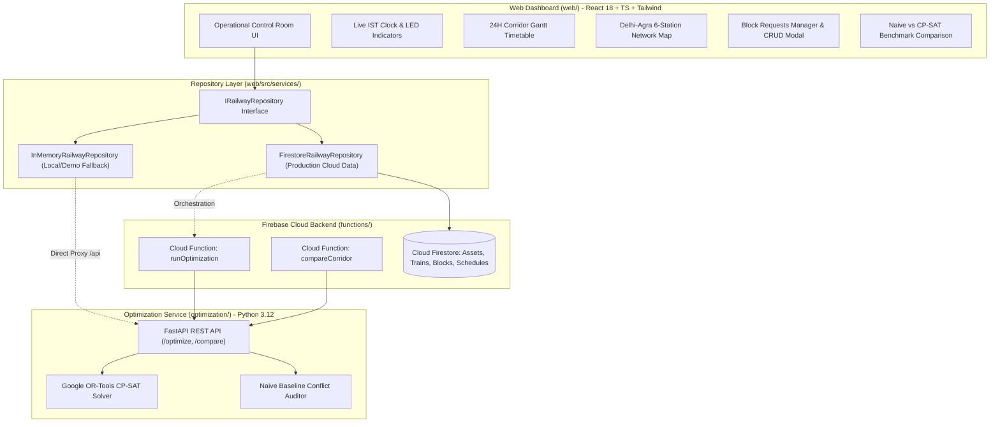

# AI-Powered Automated Block Planning for Indian Railways (SIH)

[]()
[]()
[]()
[]()

> **Smart India Hackathon (SIH) Project**  
> AI-powered automated maintenance block scheduling system for Indian Railways. Maximizes infrastructure asset availability, eliminates train traffic conflicts, resolves maintenance crew bottlenecks, and generates mathematically optimal corridor schedules.

---

## ⚠️ Synthetic Demo Data Disclaimer
> **[DEMO DATA — NOT REAL INDIAN RAILWAYS DATA]**  
> All train schedules, asset identifiers, station names, maintenance demands, and operational safety buffers (e.g. 15-minute headway buffer) used in this repository are **purely synthetic demonstration assumptions**. They do not represent official Indian Railways schedules, rules, or operational parameters.

---

## 🚆 System Overview

Maintaining track infrastructure, catenary (OHE), signaling, and bridges while preserving strict passenger and freight train punctuality is one of the most critical operational challenges on Indian Railways.

This system takes:
- **Track Infrastructure Assets** (corridor sections, speed limits, electrification status)
- **Timetabled Train Movements** (entry/exit times, train priorities: Rajdhani, Shatabdi, Vande Bharat, Freight)
- **Maintenance Block Demands** (requested durations, time windows, priorities: Emergency to Low, power block requirements)
- **Resource Constraints** (maintenance crew team capacities)

And formulates a **Constraint Programming (CP-SAT)** model using Google OR-Tools to generate an optimal maintenance schedule that **guarantees zero train conflicts**, minimizes block timing shifts, and respects crew capacities.

---

## 🏛️ Architecture

$$\text{React Web (Port 3000)} \xleftrightarrow{\text{Vite Proxy / Fetch}} \begin{cases} \text{Firebase Cloud Functions (Orchestration)} \\ \text{FastAPI Optimization Engine (Port 8000)} \end{cases} \longleftrightarrow \text{Google OR-Tools CP-SAT}$$



---

## 🛠️ Tech Stack

- **Frontend**: React 18, TypeScript, Tailwind CSS, Lucide Icons, Vite (8-bit railway control-room theme)
- **Backend & Cloud**: Firebase Hosting, Cloud Firestore, Cloud Functions (Node 18+ / TypeScript)
- **Optimization Service**: Python 3.12, Google OR-Tools (`cp_model`), FastAPI, Pydantic v2, Uvicorn
- **Testing**: Pytest, FastAPI TestClient, TypeScript strict compiler

---

## 📁 Monorepo Structure

```
sih/
├── web/                                      # React 18 + TypeScript + Tailwind CSS Frontend
│   ├── src/
│   │   ├── components/                       # Pixel-art UI components (Header, Gantt, Map, Modal)
│   │   ├── services/                         # Dual repository (Firestore + In-Memory Fallback)
│   │   ├── types/                            # Domain TypeScript definitions
│   │   ├── App.tsx                           # Main application controller
│   │   └── main.tsx                          # React entry point
│   ├── index.html                            # Retro typography & pixel art stylesheets
│   ├── vite.config.ts                        # Development server with /api proxy to FastAPI
│   └── tsconfig.json                         # Strict TypeScript configuration
├── functions/                                # Firebase Cloud Functions (TypeScript)
│   ├── src/
│   │   ├── services/optimizerClient.ts       # HTTP client calling FastAPI endpoints
│   │   └── index.ts                          # Callable Cloud Functions: runOptimization, compareCorridor
│   └── package.json & tsconfig.json          # Node 18+ configuration
├── optimization/                             # Python CP-SAT Optimization Package
│   ├── src/
│   │   ├── api/server.py                     # FastAPI REST API (/optimize, /compare, /health)
│   │   ├── solver/engine.py                  # CP-SAT Constraint Programming Solver
│   │   ├── solver/naive_scheduler.py         # Naive unconstrained baseline scheduler
│   │   ├── solver/comparator.py              # Operational metrics comparison engine
│   │   ├── data/congested.py                 # 11 trains, 10 blocks, 2 crews congested benchmark
│   │   ├── data/synthetic.py                 # Standard Delhi-Agra baseline corridor
│   │   └── main.py                           # CLI entry point
│   └── tests/                                # 27 Unit & End-to-End Integration Tests
├── data/schemas/                             # JSON Schemas for assets, trains, blocks, schedules
├── docs/                                     # Architecture & Optimization Model documentation
├── firebase.json & firestore.rules           # Firebase project configurations
└── README.md
```

---

## 🚀 Quick Start Guide

### Prerequisites
- Python 3.10+ (tested on Python 3.12)
- Node.js 18+ and npm
- Git

### 1. Run the Python CP-SAT Optimization Service
```bash
cd optimization
pip install -r requirements.txt
python3 -m uvicorn src.api.server:app --port 8000 --reload
```
- Interactive OpenAPI / Swagger Docs: `http://127.0.0.1:8000/docs`
- Health check: `http://127.0.0.1:8000/health`

### 2. Run the Web Operations Dashboard
```bash
cd web
npm install
npm run dev
```
- Open `http://localhost:3000` in your browser.
- Vite automatically proxies `/api/*` requests to the FastAPI service at `http://127.0.0.1:8000`.

### 3. Firebase & Local Fallback Mode
- The system features **automatic dual-mode data layer detection**:
  - **Local/Demo Fallback Mode** (default): Operates with 100% functionality without requiring Firebase credentials or cloud billing. Uses in-memory state with immediate CP-SAT execution.
  - **Cloud Firestore Mode**: Set `VITE_FIREBASE_API_KEY` and project variables in `.env` to enable live cloud persistence and Cloud Functions orchestration.

---

## 🧪 Testing & Verification

### Run Python Optimizer Tests (27 Passing Tests)
```bash
cd optimization
pytest -v
```

### Build Cloud Functions
```bash
cd functions
npm install
npm run build
```

### Build Web Frontend
```bash
cd web
npm run build
```

---

## 📊 Milestone Status

- [x] **Milestone 1**: Standalone CP-SAT Optimization Package (Models, 5 Track Sections, Trains, Blocks, Solver, FastAPI).
- [x] **Milestone 1.5**: Congested Corridor Benchmark & Naive Scheduler Comparator (11 trains, 10 blocks, 2 crews; proves elimination of 12 conflicts and 1,235 min delay).
- [x] **Milestone 2**: Firebase Integration & 8-Bit Pixel-Art Railway Operations Dashboard (Live IST clock, 24H Gantt, 6-station network map, CRUD modal, dynamic benchmark view).
- [ ] **Milestone 3**: Multi-corridor, junction routing alternatives, and dynamic speed-restriction modeling.
