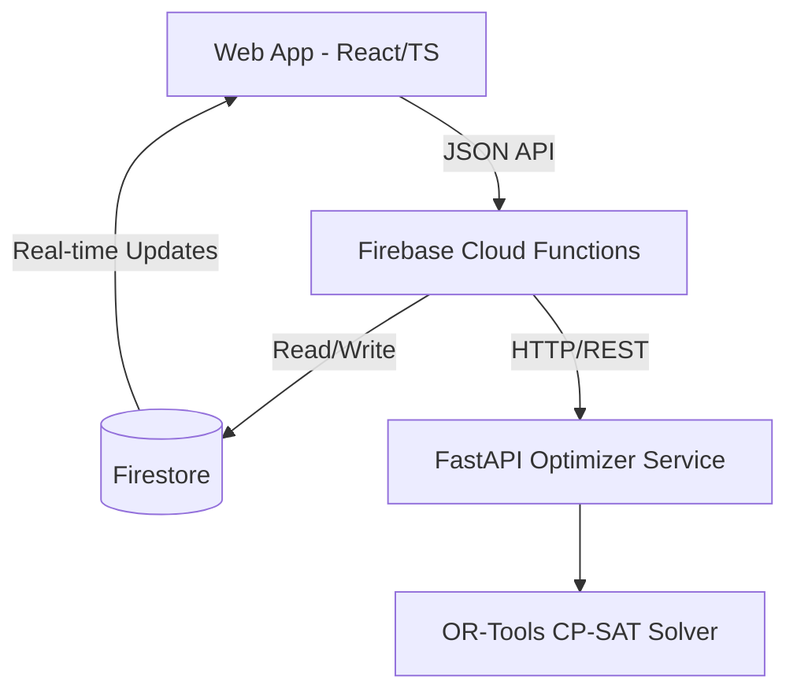

# Architecture Document

## System Overview
The AI-Powered Automated Block Planning system is designed to optimize railway maintenance blocks by minimizing train movement conflicts. 

## Data Flow
1. **Inputs**: Synthetic data (trains, assets, block requests) are generated/uploaded.
2. **Constraints Definition**: Constraints like safety buffers and track capacity are applied.
3. **CP-SAT Solving**: The Python optimizer formulates the problem and runs the OR-Tools solver.
4. **Optimized Schedule**: Results are parsed back into JSON.
5. **UI Rendering**: The web app retrieves the schedule from Firestore and visualizes it.

## Technology Choices
- **Frontend**: React + TS + Tailwind (fast development, strong typing)
- **Backend**: Firebase Functions & Firestore (easy real-time sync, serverless scaling)
- **Optimization**: Python + OR-Tools CP-SAT (state-of-the-art constraint programming solver) + FastAPI for service wrapping.

## Component Responsibilities
- **Web**: Visualization, data entry, trigger optimization runs.
- **Functions**: API Gateway, auth, Firestore triggers.
- **Optimizer**: Pure math/optimization logic.
- **Data**: Schemas and demo data generators.

## Deployment Strategy
- **Web App**: Firebase Hosting
- **Backend API**: Firebase Cloud Functions
- **Optimizer**: Cloud Run (Containerized FastAPI app) or standalone VM for heavy compute.

## Future Extensibility Notes
- The optimizer can be expanded for multi-day planning and interlocking logic.
- The data schemas are designed to be extensible to accommodate more complex railway network layouts.
